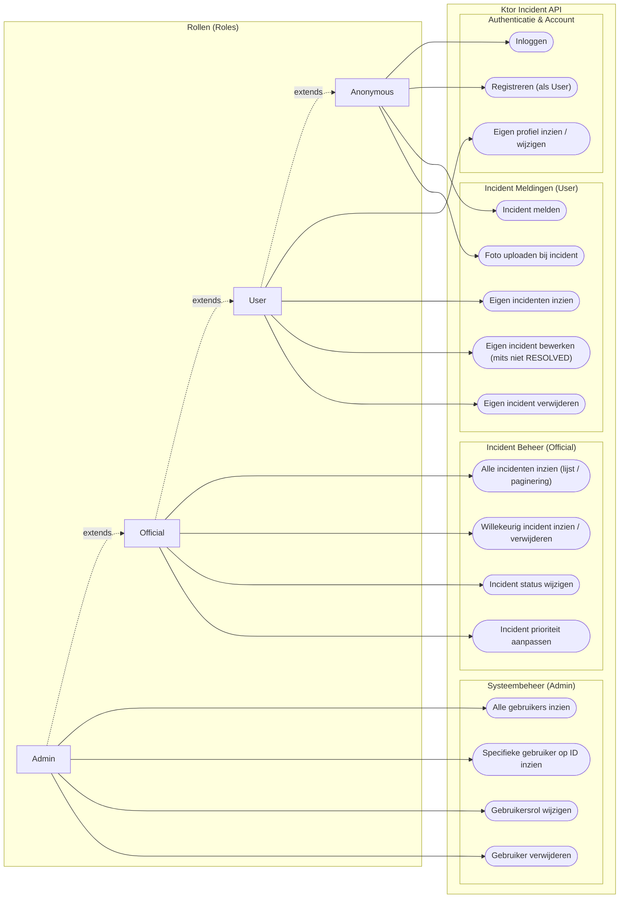

# Ontwerpdocument: Beveiliging, Rollen en Permissies (RBAC)

Dit document beschrijft het autorisatie- en beveiligingsontwerp voor de **Ktor Incident API** (`ktor-incident-api`). Het definieert de verschillende gebruikersrollen, visualiseert de use cases per rol en specificeert de complete permissiematrix inclusief eigenaarschap van resources (*Resource Ownership*).

---

## 1. Rollen Definiëren

De applicatie hanteert het principe van *least privilege*. Binnen de API worden vier niveaus van toegang onderscheiden. In de code (`avans.avd.users.User.kt`) zijn de geauthenticeerde rollen vastgelegd via het enum `Role { USER, OFFICIAL, ADMIN }`, dat de Ktor-interface `AuthenticationRole` implementeert. Daarnaast worden ongeauthenticeerde verzoeken behandeld als `Anonymous`.

### Rollen hiërarchie (`Role.implied`)

De rollen zijn hiërarchisch: een hogere rol *impliceert* alle lagere rollen. Dit is vastgelegd in de property `Role.implied`, die de verzameling van alle geïmpliceerde rollen (inclusief de rol zelf) teruggeeft:

```kotlin
enum class Role : AuthenticationRole {
    USER,
    OFFICIAL,
    ADMIN;

    /** All roles this role implies, including itself. */
    val implied: Set<Role>
        get() = entries.filter { it.ordinal <= ordinal }.toSet()
}
```

| Rol van de gebruiker | `implied` |
| :--- | :--- |
| `USER` | `{USER}` |
| `OFFICIAL` | `{USER, OFFICIAL}` |
| `ADMIN` | `{USER, OFFICIAL, ADMIN}` |

Hierdoor hoeft een route die voor ambtenaren bedoeld is alleen `Role.OFFICIAL` te vereisen; een `ADMIN` voldoet daar automatisch aan. De volgorde van de enum-waarden bepaalt dus de hiërarchie.

| Rol | Type | Omschrijving | Rechtenniveau |
| :--- | :--- | :--- | :--- |
| **Anonymous** | Niet-ingelogd | Een willekeurige burger of gast zonder JWT token. | Kan inloggen, een account registreren, publieke statische afbeeldingen opvragen en laagdrempelig anoniem incidenten melden (inclusief foto's uploaden). Heeft geen toegang tot historiek of beheer. |
| **User** | Ingelogd (`Role.USER`) | Een geregistreerde burger of melder met een geldig JWT token. | Kan het eigen profiel beheren en incidenten melden die gekoppeld worden aan diens `userId`. Mag uitsluitend de eigen gemelde incidenten inzien, bewerken (mits nog niet afgehandeld) of verwijderen. |
| **Official** | Ingelogd (`Role.OFFICIAL`) | Een ambtenaar, behandelaar of hulpdienstmedewerker (`isQualifiedOfficial`). | Mag alle gemelde incidenten inzien en doorzoeken. Is bevoegd om de status (`status`) en prioriteit (`priority`) van incidenten aan te passen. Contactgegevens van melders worden direct meegeleverd bij het opvragen van een incident. |
| **Admin** | Ingelogd (`Role.ADMIN`) | Systeembeheerder met volledige controle over de API en gebruikers. | Beschikt over alle rechten van een `Official`, aangevuld met gebruikersbeheer: alle gebruikers opvragen, specifieke gebruikersprofielen opvragen, gebruikersrollen wijzigen en gebruikersaccounts verwijderen. |

---

## 2. Use Case Diagram

### Legenda Rollen (Engels / Nederlands)

| Role (English) | Rol (Nederlands) | Toelichting / Rechten |
| :--- | :--- | :--- |
| **Anonymous** | Anonieme bezoeker / Gast | Publieke toegang; laagdrempelig incident melden en account registreren. |
| **User** | Geregistreerde burger / gebruiker | Eigen profiel en eigen gemelde incidenten beheren. |
| **Official** | Ambtenaar / behandelaar | Alle incidenten inzien, status en prioriteit wijzigen; ziet meldergegevens bij incidenten. |
| **Admin** | Systeembeheerder | Volledige rechten inclusief gebruikersbeheer (inzien, rol wijzigen, verwijderen). |

### PlantUML Specificatie

De formele use case-specificatie is opgeslagen als een los PlantUML-bronbestand:
👉 **[`docs/puml/use-case-diagram.puml`](puml/use-case-diagram.puml)**

Omdat PlantUML in standaard Markdown-viewers (zoals GitHub) niet direct als grafische afbeelding zichtbaar is, wordt de broncode niet inline getoond, maar via bovenstaande verwijzing beschikbaar gesteld. Dit bestand kan direct worden geopend en visueel bewerkt in IntelliJ IDEA (met de PlantUML-plugin) of geëxporteerd worden naar PNG/SVG.

> Zie voor praktische tips en alternatieven ook het aparte document:  
> [Tips voor het gebruik van PlantUML en Mermaid](tips-plantuml-en-mermaid.md)

### Mermaid Diagram (Direct zichtbaar in GitHub / Markdown viewer)



---

## 3. Permissiematrix (RBAC & Resource Ownership)

In de Ktor Incident API wordt autorisatie op twee niveaus gecombineerd:
1. **Role-Based Access Control (RBAC)**: Mag de rol van de aanroeper het endpoint in principe gebruiken? Dit wordt declaratief op routeniveau afgedwongen via `authenticateWith(roleAuth, roles = setOf(...))` (zie hoofdstuk 4).
2. **Resource Ownership (ABAC)**: Is de ingelogde gebruiker de eigenaar van het specifieke object? (`foundIncident.isReportedByCurrentUser(userId)` of `foundUser.id == call.userId()`).

| Resource | CRUD / Actie | HTTP Endpoint | Anonymous | User | Official | Admin | Voorwaarden & Logica |
| :--- | :--- | :--- | :---: | :---: | :---: | :---: | :--- |
| **Auth** | Inloggen | `POST /api/auth/login` | ✅ | ✅ | ✅ | ✅ | Valideert credentials en retourneert JWT token |
| **User** | Registreren | `POST /api/users/register` | ✅ | ❌ | ❌ | ❌ | Registreert nieuw account; krijgt altijd `Role.USER` |
| **User** | Eigen profiel inzien | `GET /api/users/me` | ❌ | ✅ | ✅ | ✅ | Haalt data op basis van `call.principal` |
| **User** | Eigen profiel wijzigen | `PUT /api/users/me` | ❌ | ✅ | ✅ | ✅ | Wachtwoord, e-mail, avatar; rol kan niet zelf gewijzigd worden |
| **User** | Alle gebruikers ophalen | `GET /api/users` | ❌ | ❌ | ❌ | ✅ | Route in `authenticateWith(roleAuth, roles = setOf(Role.ADMIN))` |
| **User** | Gebruiker op ID inzien | `GET /api/users/{id}` | ❌ | ❌ | ❌ | ✅ | Route in `authenticateWith(roleAuth, roles = setOf(Role.ADMIN))` |
| **User** | Rol wijzigen | `PUT /api/users/{id}/role` | ❌ | ❌ | ❌ | ✅ | Route in `authenticateWith(roleAuth, roles = setOf(Role.ADMIN))` |
| **User** | Gebruiker verwijderen | `DELETE /api/users/{id}` | ❌ | ❌ | ❌ | ✅ | Route in `authenticateWith(roleAuth, roles = setOf(Role.ADMIN))` |
| **Incident** | Incident melden | `POST /api/incidents` | ✅ | ✅ | ✅ | ✅ | `authenticateWithOptional`: koppelt `userId` indien ingelogd |
| **Incident** | Afbeelding uploaden | `POST /api/incidents/{id}/images` | ✅ | ✅ | ✅ | ✅ | Multipart/form-data gekoppeld aan `incidentId` |
| **Incident** | Eigen incidenten ophalen | `GET /api/incidents/my-incidents` | ❌ | ✅ | ✅ | ✅ | Filtert op `userId == principal.user.id` |
| **Incident** | Incidenten van gebruiker | `GET /api/users/{id}/incidents` | ❌ | ⚠️ Eigen | ✅ | ✅ | Toegankelijk voor eigenaar (`id == userId`) of Official/Admin |
| **Incident** | Alle incidenten ophalen | `GET /api/incidents` | ❌ | ❌ | ✅ | ✅ | Route in `authenticateWith(roleAuth, roles = setOf(Role.OFFICIAL))` |
| **Incident** | Incidenten gepagineerd | `GET /api/incidents/paginated` | ❌ | ❌ | ✅ | ✅ | Query parameters `page` en `pageSize`; route in `authenticateWith(roleAuth, roles = setOf(Role.OFFICIAL))` |
| **Incident** | Incident op ID opvragen | `GET /api/incidents/{id}` | ❌ | ⚠️ Eigen | ✅ | ✅ | Eigenaar of Official/Admin (inclusief geneste `reporter`-contactgegevens); bij ongeautoriseerde `User` volgt `404` |
| **Incident** | Incident bijwerken | `PUT /api/incidents/{id}` | ❌ | ⚠️ Eigen | ✅ | ✅ | Alleen als `!foundIncident.isResolved` én (eigenaar of Official/Admin), anders `403` |
| **Incident** | Status wijzigen | `PATCH /api/incidents/{id}/status` | ❌ | ❌ | ✅ | ✅ | Route in `authenticateWith(roleAuth, roles = setOf(Role.OFFICIAL))` |
| **Incident** | Prioriteit wijzigen | `PATCH /api/incidents/{id}/priority` | ❌ | ❌ | ✅ | ✅ | Route in `authenticateWith(roleAuth, roles = setOf(Role.OFFICIAL))` |
| **Incident** | Incident verwijderen | `DELETE /api/incidents/{id}` | ❌ | ⚠️ Eigen | ✅ | ✅ | Eigenaar of Official/Admin; verwijdert ook bijbehorende afbeeldingen |
| **Uploads** | Statische afbeelding inzien | `GET /uploads/{file}` | ✅ | ✅ | ✅ | ✅ | Publiek toegankelijk via static content routing |

*Legenda:*
- ✅ = Volledig toegestaan.
- ❌ = Niet toegestaan (resulteert in `401 Unauthorized` of `403 Forbidden`).
- ⚠️ Eigen = Alleen toegestaan wanneer de resource eigendom is van de aanvrager (`isReportedByCurrentUser(userId)` of `user.id == userId`).

---

## 4. Ktor Beveiligingsarchitectuur & Foutafhandeling

### Typed Authentication Scheme met rollen (`JwtService.kt`)
De beveiliging is gebouwd op de *typed authentication API* van Ktor 3.6. In `JwtService` wordt eerst een JWT-scheme (`authScheme`) gedefinieerd dat een `UserPrincipal` oplevert. Daarbovenop wordt met `withRoles` een rolbewust scheme gemaakt:

```kotlin
typealias RoleAuthScheme =
    AuthenticationSchemeWithRoles<UserPrincipal, Role, Unit, SimpleAuthenticationScheme<UserPrincipal>>

val roleAuth: RoleAuthScheme = authScheme.withRoles(
    onForbidden = {
        call.respond(
            HttpStatusCode.Forbidden,
            mapOf("error" to "You do not have permission to access this resource.")
        )
    }
) { principal ->
    principal.user.role.implied
}
```

De lambda bepaalt welke rollen een principal *bezit*. Omdat Ktor vereist dat **alle** aan een route opgegeven rollen aanwezig zijn (`containsAll`), wordt hier niet alleen de eigen rol maar de volledige set `Role.implied` teruggegeven. Zo werkt de rolhiërarchie uit hoofdstuk 1 automatisch door in alle routes. De typed schemes registreren zichzelf bij de applicatie zodra ze aan een route worden gekoppeld; een aparte `install(Authentication)`-stap is niet nodig. `roleAuth` wordt via `incidentsModule(...)` en `usersModule(...)` aan de route-functies doorgegeven.

### Authenticatie Scopes
In de Ktor routing (`IncidentRoutes.kt` en `UserRoutes.kt`) worden endpoints onderverdeeld in:
1. **Publiek**: Geen authenticatie-wrapper (bijvoorbeeld `/api/auth/login`, `/api/users/register`, `/uploads`).
2. **Optioneel geauthenticeerd (`authenticateWithOptional(roleAuth)`)**: Voor `POST /api/incidents` en `POST /api/incidents/{id}/images`. Indien een geldig Bearer-token aanwezig is, wordt het `userId` gekoppeld; ontbreekt het token, dan wordt het verzoek als anoniem opgeslagen.
3. **Strikt geauthenticeerd (`authenticateWith(roleAuth)`)**: Vereist een valide JWT-token, ongeacht de rol. Ontbreekt het token, dan onderschept Ktor dit automatisch met een `401 Unauthorized`. Hier vallen o.a. `/my-incidents`, `/me` en de ownership-gebonden `GET`/`PUT`/`DELETE /api/incidents/{id}` onder.
4. **Rolgebonden (`authenticateWith(roleAuth, roles = setOf(...))`)**: Vereist een valide token **én** de opgegeven rol (of een rol die deze impliceert). Voldoet de gebruiker niet, dan antwoordt Ktor via `onForbidden` met `403 Forbidden`, nog vóór de route-handler wordt uitgevoerd.

```kotlin
// IncidentRoutes.kt – alleen OFFICIAL en (via implied) ADMIN
authenticateWith(roleAuth, roles = setOf(Role.OFFICIAL)) {
    get { ... }                          // GET /api/incidents
    get("/paginated") { ... }
    patch("/{incidentId}/priority") { ... }
    patch("/{incidentId}/status") { ... }
}

// UserRoutes.kt – alleen ADMIN
authenticateWith(roleAuth, roles = setOf(Role.ADMIN)) {
    get { ... }                          // GET /api/users
    get("/{id}") { ... }                 // GET /api/users/{id}
    put("/{id}/role") { ... }
    delete("/{id}") { ... }
}
```

Rolautorisatie is daarmee volledig declaratief: er staan geen handmatige rolcontroles meer in de route-handlers.

### Extension Helpers (`ApplicationCallUtil.kt`)
Voor de *ownership*-controles, die niet als route-eis uit te drukken zijn, blijven enkele beknopte helpers bestaan:
- `call.userId()`: Haalt het id van de ingelogde gebruiker op uit het `UserPrincipal` (of `null` indien anoniem).
- `call.userRole()`: Haalt de huidige rol op uit het `UserPrincipal`.
- `isQualifiedOfficial()`: Geeft `true` terug indien `Role.OFFICIAL` in `userRole().implied` zit (dus voor `OFFICIAL` én `ADMIN`).

Deze worden uitsluitend gebruikt in combinatie met eigenaarschap, bijvoorbeeld:

```kotlin
val canModify = !foundIncident.isResolved
        && (isQualifiedOfficial() || foundIncident.isReportedByCurrentUser(userId))
```

### Foutafhandeling via StatusPages (`StatusPages.kt`)
Alle fouten worden centraal getransleerd naar uniforme JSON-foutberichten:
- **`401 Unauthorized`**: Token ontbreekt of is ongeldig.
  ```json
  { "error": "Authentication is required to access this resource" }
  ```
- **`403 Forbidden`**: Wel ingelogd, maar ontoereikende rechten. Dit wordt op drie plaatsen afgehandeld met dezelfde JSON-structuur:
  1. Rolgebonden routes: de `onForbidden`-callback van `roleAuth` (zie boven).
  2. Ownership-checks in de handler, bijv. `PUT /api/incidents/{id}` op een afgehandeld of niet-eigen incident: expliciete `call.respond(HttpStatusCode.Forbidden, ...)` met een specifieke melding.
  3. Fallback `status(HttpStatusCode.Forbidden)` in `StatusPages.kt` voor eventuele body-loze 403-antwoorden van Ktor zelf.
  ```json
  { "error": "You do not have permission to access this resource." }
  ```
- **`404 Not Found` (Preventie van Information Disclosure)**:
  Wanneer een normale `User` probeert een incident (`GET /api/incidents/{id}`) of profiel (`GET /api/users/{id}/incidents`) van een andere gebruiker op te vragen, retourneert de server opzettelijk een `404 Not Found` in plaats van een `403 Forbidden`. Hierdoor kunnen kwaadwillenden geen geldige ID's afleiden uit het verschil in statuscodes (*resource enumeration prevention*).
